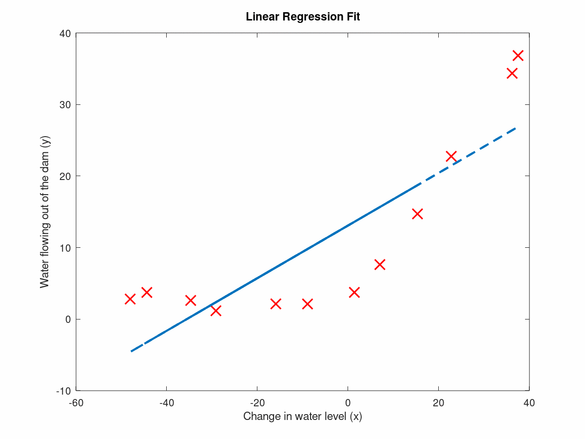
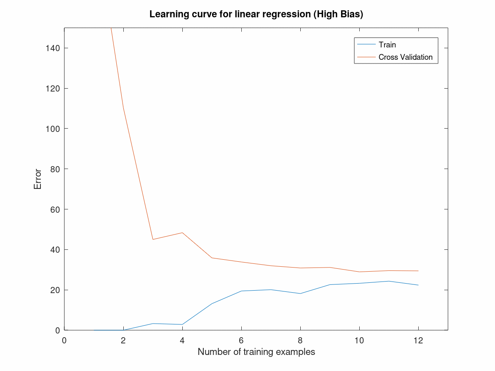
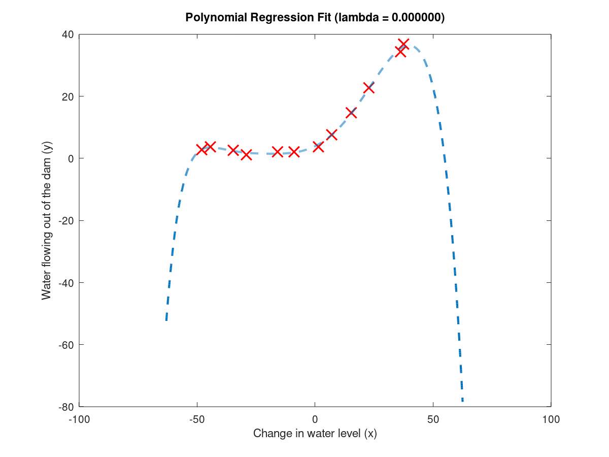
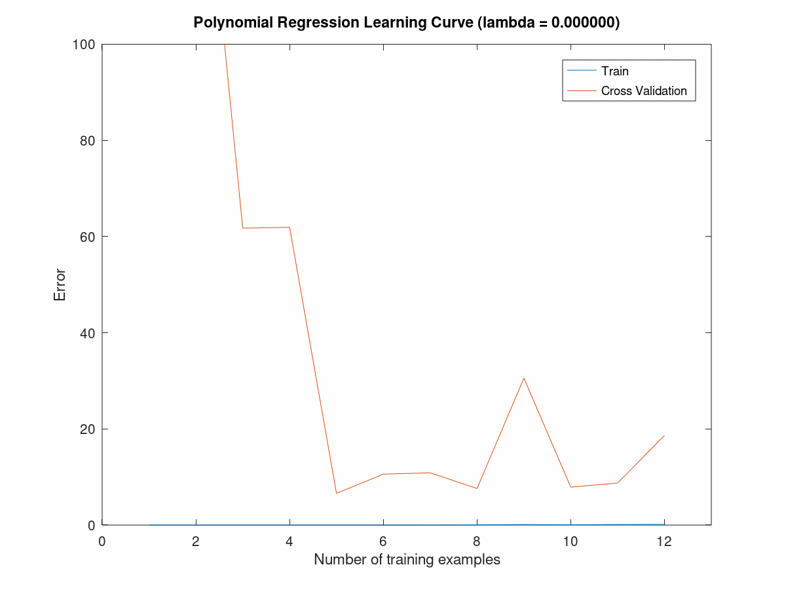
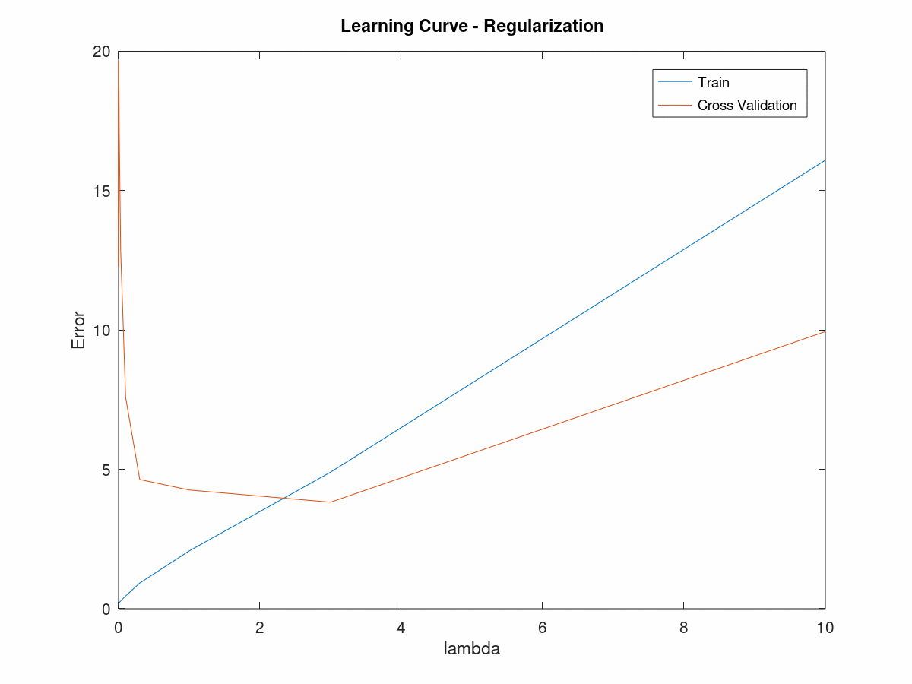

# Machine Learning Diagnostics - Bias vs. Variance

Implementing a regularized linear regression model on Octave, we examine the effects of bias vs. variance and diagnostics of debugging our learning algorithm.
   - [Bias vs. Variance Diagnostics](./diagnostics.m)

## Bias vs. Variance Diagnostics

To run the model, run the command `diagnostics` on Octave and making sure that you are on the correct working directory to successfully run the program.

The [Water Levels Dataset](./waterLevel.mat) contains the changes in water level and the amount of water flowing out of a dam.

We use a linearized linear regression model to predict the amount of water flowing out of a dam based on its changes in water level.

### High Bias Case

Computing the [Cost Function and Gradients](./linearRegCostFunction.m) and optimizing using the [fmincg function](./fmincg.m), we are able to fit and train our parameters [Theta](./trainLinearReg.m). By iterating this process as a function of the number of training set from 1 to m, we can build the learning curve. Below shows the figures of the high bias case. It can be seen that the model is too simple and that it is underfitting the data. In the learning curve we can see that the error function for both the training set and cross validation set are high. This depicts a high bias case where we require a more complex model.

### High Variance Case

For a more complex model, one way to approach this would be to implement polynomial features. By transforming our features to a [polynomial feature](./polyFeatures.m), we can come up with a more complex model to diagnose the underfitting scenario. By performing [feature normalization](./featureNormalize.m) and by using the fmincg function to train our parameters theta, we can build another learning curve of our new model. Below shows the figures of the high variance case. It can be seen that the model is now too complex and that it is overfitting the data. It fits the training dataset well but is unable to fit new data that it has not seen before. In the learning curve we can see that the error function of the training example remains low while the cross validation set still remains high. This depicts a high variance case where we would need to simplify the model or implement regularization.

### Regularization

When the model is too complex, we risk overfitting the data in a high variance case. To compensate for this, we can implement regularization. A model without regularization fits the training set well but does not generalize well while a model with too much regularization is not able to fit the training data. The degree of regularization is determined by the regularization parameter, lambda. By building a learning curve of the error function in respect to lambda, we can determine the optimal value of lambda. The figure below shows the error of the model for different values of lambda. It can be seen that a lambda value of 3 is optimal in this case.

