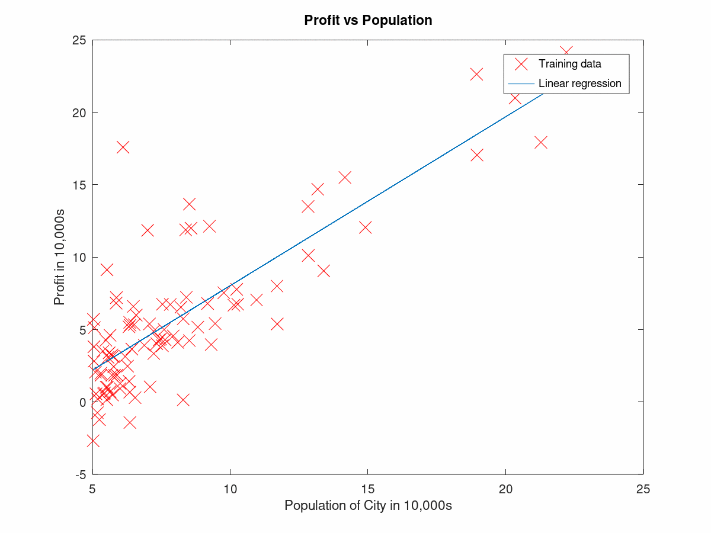
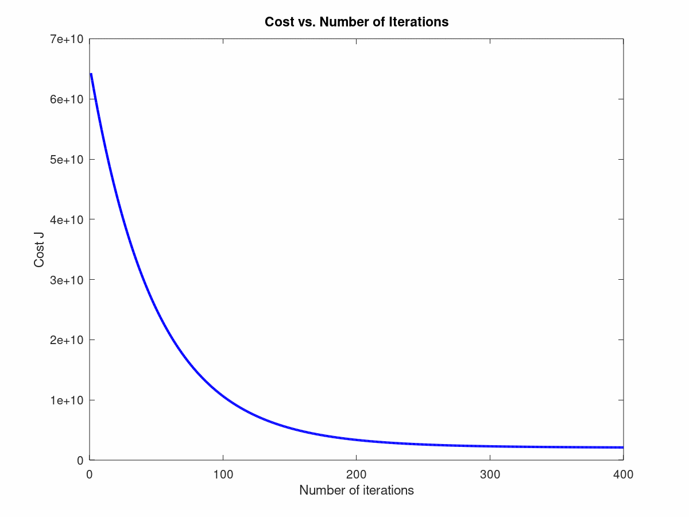

# Linear Regression Model

Implementation of Univariate and Multivariate Linear Regression Models which are built and trained on Octave.
   - [Univariate Linear Regression](./uni.m)
   - [Multivariate Linear Regression](./multi.m)

## Univariate Linear Regression

To run the model, run the command `uni` on Octave and making sure that you are on the correct working directory to successfully run the program.

The [Profits Dataset](./profits.txt) contains a city's population and the profits in that city. We train our univariate linear regression model to predict the profit in a city based on the city's population.

To train our model we use [Gradient Descent](./gradientDescent.m). First by computing our [Cost Function](./computeCost.m), we then run [Gradient Descent](./gradientDescent.m) to minimize our Cost, J, in respect to our parameter Theta.

The figure below shows the Univariate Linear Regression Model.

## Multivariate Linear Regression

To run the model, run the command `multi` on Octave and making sure that you are on the correct working directory to successfully run the program.

The [Housing Dataset](./housing.txt) contains house sizes, the number of bedrooms, and the price of the houses. We train our multivariate linear regression model to predict a housing price based on its size and its number of bedrooms.

To train our model we use [Gradient Descent](./gradientDescentMulti.m). First by computing our [Cost Function](./computeCostMulti.m), we then run [Gradient Descent](./gradientDescentMulti.m) to minimize our Cost, J, in respect to our parameter Theta.

The [Normal Equation](./normalEqn.m) is a closed-form solution to linear regression that does not require a loop until convergence algorithm or feature scaling. Using both the Gradient Descent method and the Normal Equation gives us very similar predictions.

The figure below shows a convergence test of our Multivariate Linear Regression Model.

