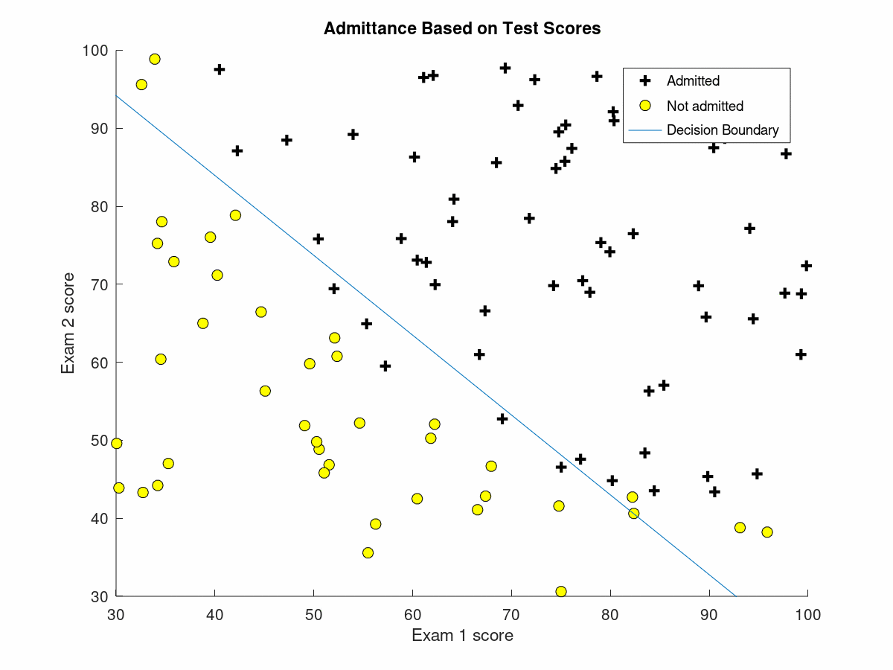
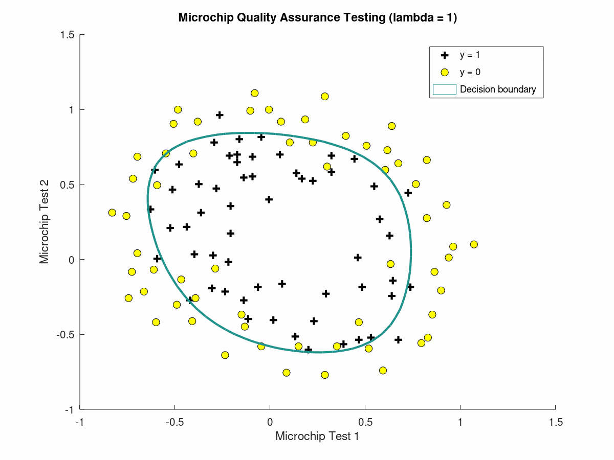

# Logistic Regression Model

Implementation of the Logistic Regression Models are built and trained on Octave.
   - [Logistic Regression](./logisticRegression.m)
   - [Regularized Logistic Regression](./regularization.m)
   - [One vs. All Logistic Regression](./multiClassifiers.m)

## Logistic Regression

To run the model, run the command `logisticRegression` on Octave and making sure that you are on the correct working directory to successfully run the program.

The [Test Scores Dataset](./testScores.txt) contains 2 sets of test scores and whether or not the student was admitted or not admitted to university. We train our logistic regression model to classify whether or not a student will be admitted or not based on their test scores.

To train our model we use a built in optimizer method fminunc to find the optimal theta parameter. First by computing our [Cost Function and Gradient](./costFunction.m), we then run the fminunc to minimize our Cost, J, in respect to our parameter Theta. By setting our threshold value at 0.5, we then [predict](./predict.m), whether a student is admitted (y=1) or not admitted (y=0).

The figure below shows the trained Logistic Regression model.

## Regularized Logistic Regression

To run the model, run the command `regularized` on Octave and making sure that you are on the correct working directory to successfully run the program.

The [Quality Assurance Dataset](./qualityAssurance.txt) contains quality control test results on microchips and whether or the label of whether or not the microchip was defective. We train our regularized logistic regression model to classify whether or not the microchip requires further quality testing.

To train our model we use a built in optimizer method fminunc to find the optimal theta parameter. First by computing our [Regularized Cost Function and Gradient](./costFunctionReg.m), we then run the fminunc to minimize our Cost, J, in respect to our parameter Theta. By setting our threshold value at 0.5, we then [predict](./predict.m), whether a microchip requires further testing (y=1) or not (y=0).

The figure below shows the trained Logistic Regression model.

## One vs. All Logistic Regression

To run the model, run the command `multiClassifiers` on Octave and making sure that you are on the correct working directory to successfully run the program.

The [Handwritten Digits Dataset](./handWrittenDigits.txt) contains training examples of handwritten digits. We train our One vs. All logistic regression model to recognize and classify a handwritten digit from 0 to 9.

To train our model we use the [fmincg](./fmincg.m). First by computing our [Regularized Cost Function and Gradient](./lrCostFunction.m), we then run the [fmincg](./fmincg.m) in the [oneVsAll](./oneVsAll.m) method to minimize our Cost, J, in respect to our parameters Theta. The iteration takes place on each label from 0 to 9, where we then [predict](./predictOneVsAll.m) the digit based on the set of theta parameters with the highest probability.
