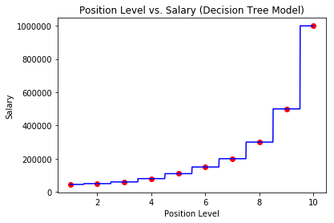

# Decision Tree Regression Model

## Decision Tree

Using Python and the scikit-learn library, we are able train and fit a decision tree model.
The [Position Salary Dataset](./Position_Salaries.csv) contains the level of a position and the salary at that level.
Using this data we train our [Decision Tree Model](./decision_tree.py) to predict the salary of an employee given their position level.

### Decision Tree Template

  1. Import libraries
      - Numpy
      - Pandas
      - Matplotlib
      - Scikit-learn

  2. Load [dataset](./Position_Salaries.csv) using Pandas

  3. Specific dataset does not require train/test set split

  4. Fit and train model using Decision Tree model on Scikit-learn

  5. Predict using the trained model on Scikit-learn

  6. Visualize results using Matplotlib while using Numpy on our features to smooth out the curve

The figure below shows the data trained on a Decision Tree Model.

