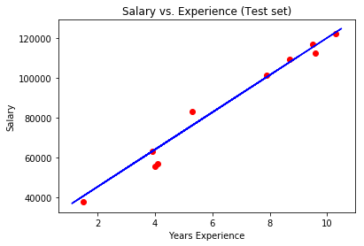
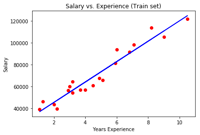

# Linear Regression Model

## Univariate Linear Regression

Using Python and the scikit-learn library, we are able train and fit a univariate linear regression model.
The [Salary Dataset](./Salary_Data.csv) contains years of experience and salary of an employee.
Using this data we train our [Univariate Linear Regression Model](./univariate.py) to predict an employee's salary based on their years of experience.

### Univariate Linear Regression Template

  1. Import libraries
    - Numpy
    - Pandas
    - Matplotlib
    - Scikit-learn

  2. Load [dataset](./Salary_Data.csv) using Pandas

  3. Split dataset into Train/Test sets using Scikit-learn

  4. Fit and train model using linear regression model using Scikit-learn

  5. Predict test set with trained model using Scikit-learn

  6. Visualize results using Matplotlib

The figures below shows our test set and train set data against our predicted model.

## Multivariate Linear Regression

Using Python and the scikit-learn library, we are able train and fit a multivariate linear regression model. The [Startup Dataset](./50_Startups.csv) contains R&D Expense, Administration Expense, Marketing Expense, the State, and the Profit of different Startup companies.
Using this data we train our [Multivariate Linear Regression Model](./multivariate.py) to predict a company's profit based on the R&D expenses, Administration expenses, Marketing expenses and the State they operate in.

Using the Backward Elimination method we can find, which variables are most significant in predicting the profit and allows us to reduce the number of features used in our model.

### Multivariate Linear Regression Template

  1. Import libraries
    - Numpy
    - Pandas
    - Matplotlib
    - Scikit-learn
    - StatsModels

  2. Load [dataset](./50_Startups.csv) using Pandas

  3. Transform categorical dataset using LabelEncoder and OneHotEncoder from Scikit-learn

  4. Split dataset into Train/Test sets using Scikit-learn

  5. Fit and train model using linear regression model using Scikit-learn

  6. Predict test set with trained model using Scikit-learn

  7. Use backward elimination method to find significant variables and optimize our model using StatsModels
