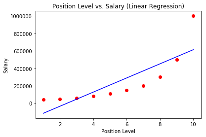
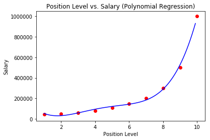

# Polynomial Regression Model

## Polynomial Linear Regression

Using Python and the scikit-learn library, we are able train and fit a polynomial linear regression model.
The [Position Salary Dataset](./Position_Salaries.csv) contains the level of a position and the salary at that level.
Using this data we train our [Polynomial Regression Model](./polynomial-regression.py) to predict the salary of an employee given their position level.

The 2 figures below shows and compares models fitted using Linear Regression and a Polynomial Regression.

