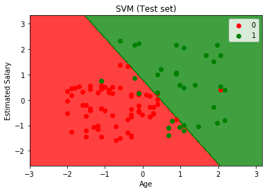
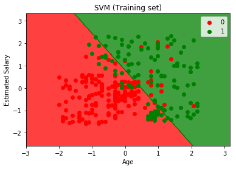

# Support Vector Machine Model

## Support Vector Machine

Using Python and the scikit-learn library, we are able train and fit a K Nearest Neighbor model.
The [Social Network Ads Dataset](./Social_Network_Ads.csv) contains a customer's age, salary and whether or not they purchased the product.
Using this data we train our [Support Vector Machine Model](./svm.py) to predict the probability of whether a customer will buy the product depending on their age and salary.

### Support Vector Machine Template

  1. Import libraries
      - Numpy
      - Pandas
      - Matplotlib
      - Scikit-learn

  2. Load [dataset](./Social_Network_Ads.csv) using Pandas

  3. Split dataset into Train/Test sets using Scikit-learn

  4. Implement feature scaling on the train and test set variables

  5. Fit and train model using Support Vector Machine model using Scikit-learn

  6. Predict test set with trained model using Scikit-learn

  7. Evaluate accuracy, precision, and recall of the model using a confusion matrix (Predicted vs. Actual)

  8. Visualize results using Matplotlib to plot the decision boundary of the model

The figures below shows the decision boundaries of the train set and test set data.

