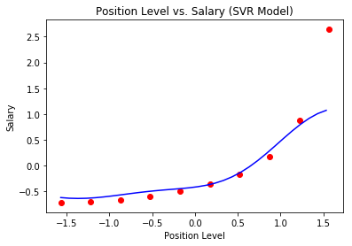

# Support Vector Regression Model

## Support Vector Regression (SVR)

Using Python and the scikit-learn library, we are able train and fit a support vector regression model.
The [Position Salary Dataset](./Position_Salaries.csv) contains the level of a position and the salary at that level.
Using this data we train our [Support Vector Regression Model](./svr.py) to predict the salary of an employee given their position level.

### Support Vector Regression Template

  1. Import libraries
    - Numpy
    - Pandas
    - Matplotlib
    - Scikit-learn

  2. Load [dataset](./Position_Salaries.csv) using Pandas

  3. Specific dataset does not require train/test set split

  4. Transform features X using feature scaling on Scikit-learn

  5. Fit and train model using SVR model on Scikit-learn

  6. Predict using the trained model on Scikit-learn

  7. Visualize results using Matplotlib while using Numpy on our features to smooth out the curve

The figure below shows the data trained on a SVR Model. Note that the model does not fit the last value of our dataset as the algorithm classified as an outlier.

